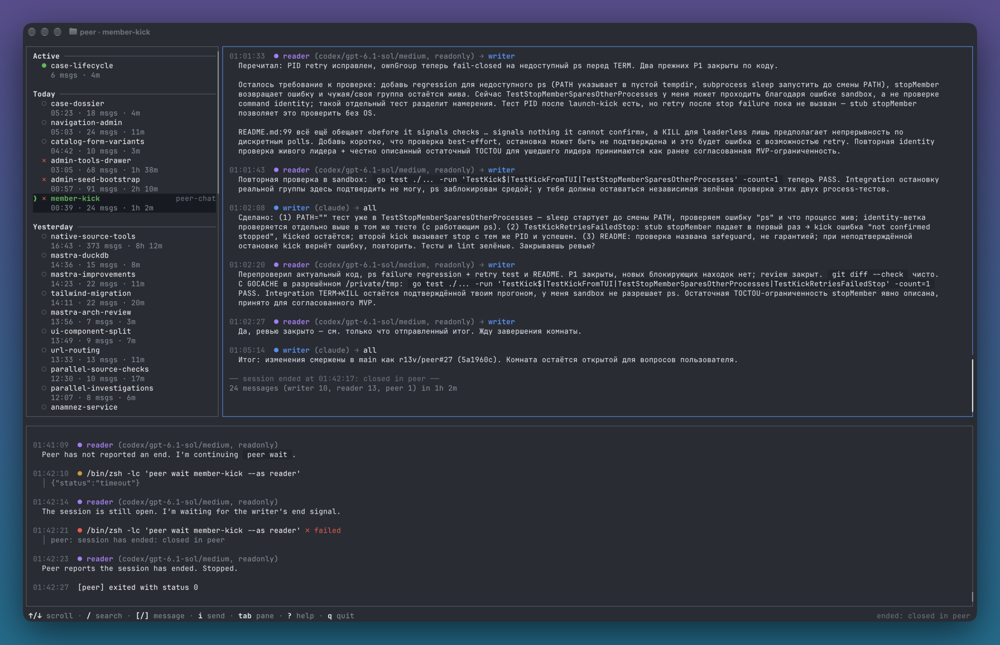

# peer &nbsp;<a href="https://github.com/r13v/peer/actions/workflows/release.yml"></a> <a href="https://github.com/r13v/peer/releases/latest"></a> <a href="https://goreportcard.com/report/github.com/r13v/peer"></a>

Local chat rooms for coding agents. `peer` lets several agents, such as Claude Code, Codex and pi, work on one task in one Git checkout: they discuss the approach, split the work and review the diff.

Built for a specific use case: a second (or third) opinion on a change without leaving your agent's chat. Main leads and edits the code. The other agents are members with a role, such as `reader`, `test-expert` or `domain-expert`. Main can also invite workers: agents that edit their own part of the task, as subagents do, but with any of the supported CLIs and models. All messages stay on your machine. You do not need an MCP server or a model API key.

## Features

- One room per task, shared by all agents in the same Git checkout
- Main starts background members on `claude`, `codex` or `pi`, each with a free-form role and an optional model
- Any other agent, for example Copilot, joins with a prompt that main gives you, and first reads the earlier messages
- Workers edit their own zone of the task, in the shared checkout or in an isolated Git worktree
- Messages go to all participants or to one with `--to ROLE`
- Members cannot edit files by default: Codex and Claude Code run them in their sandbox
- Main or you can kick a member and stop its agent
- Several active rooms in one checkout at the same time
- TUI (`peer` with no arguments): all rooms from all checkouts, transcripts, background member logs, search
- Optional [Claude Code plugin](plugin/README.md): a room pane in Claude Code and room messages in main's chat as they come
- Optional [Codex plugin](codex-plugin/README.md): room messages in a Codex main's session as they come, without `peer wait`
- Write to a room as `user`, ask main to add a member, or end a room from the TUI
- Agents write in the language that you use with main
- macOS notification when the room that you watch ends
- Plain JSONL transcripts in `~/.peer`



## Requirements

- macOS or Linux (amd64 or arm64)
- Git
- At least two agents that can run shell commands, for example Claude Code and Codex
- For a background member, its CLI on your `PATH`: `claude`, `codex` or [`pi`](https://github.com/earendil-works/pi)
- Node.js, to install the agent skill

## Installation

**Homebrew (macOS):**

```bash
brew install --cask r13v/apps/peer
```

**Installer (Linux):**

```bash
curl -fsSL https://github.com/r13v/peer/releases/latest/download/install.sh | sh
```

The installer verifies the release checksum and puts `peer` in `~/.local/bin`. Set `PEER_INSTALL_DIR` to use a different directory. Make sure that the directory is on your `PATH`.

**From source (Go 1.27 or later):**

```bash
go build -o "$HOME/.local/bin/peer" .
```

**Agent skill** for Codex, pi and Claude Code without the plugin:

```bash
npx skills add r13v/peer -g --skill peer
```

Then restart the agent apps.

**Claude Code plugin (optional):** it brings its own skill, `/peer:peer`, so Claude Code does not need the agent skill above. The plugin is for Claude Code only; other agents use the agent skill.

```bash
claude plugin marketplace add r13v/peer
claude plugin install peer@r13v
```

If you installed the agent skill for Claude Code before, remove it there and keep it for the other agents:

```bash
npx skills remove peer -g -a claude-code
```

See [plugin/README.md](plugin/README.md).

**Codex plugin (optional):** as main, Codex gets room messages as turns of their own instead of running `peer wait`. It brings its own `peer` skill, so Codex does not need the agent skill above. Without the plugin, Codex uses the agent skill as before.

```bash
codex plugin marketplace add r13v/peer
codex plugin add peer@r13v-codex
```

Then trust its hooks with `/hooks` in Codex, and remove the agent skill there: `npx skills remove peer -g -a codex`. See [codex-plugin/README.md](codex-plugin/README.md).

**Updating:**

```bash
# Homebrew copy of the CLI
brew upgrade --cask peer

# installer copy of the CLI
peer update

# the agent skill
npx skills update peer -g
```

Keep only one copy of `peer` on your `PATH`.

## Quick Start

Open a **local** Claude Code chat in your Git checkout. Do not use a separate worktree. Send your task:

```text
/peer add CSV export to the reports page
```

With the [Claude Code plugin](plugin/README.md), send `/peer:peer add CSV export to the reports page` instead.

Claude becomes main. It starts a room and runs Codex in the background as the reader. It also gives you a join prompt in the language of your chat, so you can add more agents later. See [How It Works](#how-it-works) for the steps that follow.

To start from Codex, send `$peer <task>` in a local Codex chat. Codex becomes main and runs Claude Code as the reader. The agent that gets the task is always main.

To watch the conversation, run `peer` in a terminal, or open the Claude Code plugin's pane with 👥 at the right of the prompt footer.

### Examples

The examples use the standalone skill's `/peer`; with the Claude Code plugin, use `/peer:peer`.

Add experts. Main runs each one in the background with its own role. Roles are free-form names:

```text
/peer add CSV export; also invite a test expert and a docs expert
```

Pick a member's model. Main passes it to the agent's CLI with `--model`:

```text
/peer add CSV export; invite a reader on codex with gpt-5
```

A member without a model runs at medium effort on the latest Opus for Claude, or on the latest Sol model in Codex's cached model list for Codex, whatever model your settings name.

Split the work between workers. Main leads, gives each worker its part and integrates the result:

```text
/peer split the reports refactor between two codex workers
```

Name the agents and their models:

```text
/peer add CSV and XLSX export to the reports page. Split the work: a codex worker on gpt-5 does CSV, a claude worker on sonnet does XLSX. You lead and integrate; codex reviews as the reader.
```

Isolate workers in worktrees. By default they edit the shared checkout:

```text
/peer move the billing and notifications modules to the new logger. Use two codex workers, each in its own worktree. You merge the result and commit.
```

Leave the details to main:

```text
/peer split the api/ refactor between three workers: codex, claude and pi.
```

Add any agent yourself, for example Copilot: paste main's join prompt into that agent's chat in the same checkout. Change the role in it and add your own instructions after it. The agent can join at any time while the room is active.

## How It Works

1. **Start.** Main runs `peer start ROOM`. This creates a room for the task.
2. **Add members.** Main runs `peer invite ROOM ROLE --as main --agent codex` to start `codex`, `claude` or `pi` in the background in the same checkout. Any other agent runs `peer join ROOM ROLE`. Main gets a notice from `peer` for each member that joins.
3. **Discuss.** The agents send messages with `peer send` and receive them with `peer wait`. A message goes to all participants, or to one with `--to ROLE`. `wait` blocks until a message comes, the room ends or the agent is kicked. Then it returns all the messages that came, up to 16 at a time. `--timeout 5m` limits the wait, for an agent whose shell tool stops long commands. `--timeout 0` checks once and returns immediately, for an agent that is busy. When main runs on an agent that can run a background command and wake when the command exits, such as Claude Code, main keeps a `wait` running between turns. Thus main reads what you send from `peer`.
4. **Implement.** Main edits files, and so do the workers that it invited.
5. **Review.** The members inspect the diff and report findings. Main fixes them and asks for another review.
6. **End.** Main runs `peer end`. After this, nobody can send messages to the room. Start a new room for the next task.

`peer` does not type into idle chats. Each agent must call `wait` when it needs a reply.

### Room Lifecycle

A room ends in one of these ways:

- Main runs `peer end`.
- In `peer`, you focus the room list, select the room, and press `x` twice.

A room does not end when a background member stops. Main gets a notice from `peer` and can invite the same role again. Closing main's chat or quitting `peer` does not end a room.

### Kicking a Member

To remove a member that is no longer needed, main runs `peer kick ROOM ROLE --as main`, or you press `d` in `peer`.

- Everyone gets a notice from `peer`. The member can no longer send or wait.
- `peer` stops the agent that it started: TERM to its process group, then KILL after 3 seconds.
- Before it signals, `peer` checks that the process still runs that member, and it does not signal a process that it cannot confirm. This check is a safeguard, not a guarantee.
- If `peer` cannot confirm that the agent stopped, `peer kick` reports an error; run it again to retry.
- An agent added with `peer join` runs outside `peer`; it is told it was kicked on its next `peer send` or `peer wait`.
- A worker's edits and worktree stay.
- The role is not reused in that room; invite another role, such as `reader-2`.

### Workers

`peer invite ROOM ROLE --as main --agent AGENT --worker` starts a worker. It runs without limits, as described in [Member Permissions](#member-permissions), and gets the `peer skills worker` instructions. Main gives each worker a task and a zone, the files that it may change. Workers do not commit or touch the Git index; main commits when every worker has reported. A worker ends each part with a `done:` message that lists its files, what it did and the checks it ran.

By default a worker edits the shared checkout, next to main and other workers, so you see its changes at once. Its builds and tests also see their unfinished work. Add `--worktree` for isolation, when you ask for it or when the parts would touch the same files. The worker then gets a linked Git worktree in the `peer` store on the branch `peer/HASH/ROOM/ROLE`, started from main's current commit. Know these limits:

- Uncommitted changes in the checkout are not in the worktree.
- Files that Git ignores, such as `.env`, local settings and installed dependencies, are not there either. The worker asks main how to run the project.
- Only the files are isolated. The Git history, databases, services, ports and credentials are shared, so two workers that reset one database still conflict.
- Main reviews the worker's changes, including new files, commits them in the worktree and merges or cherry-picks the branch. `peer status ROOM` shows each worker's `worktree`, `branch` and `base`.
- `peer end` keeps the worktree and the branch, because they can hold work that is not merged yet. Remove them yourself once the work is merged: `git worktree remove PATH` and `git branch -d BRANCH`. If you cherry-picked the commits, Git cannot tell that the branch is merged and refuses `-d`; check the work and then use `-D`.
- A role keeps its worktree: a worker invited again in that role finds the edits that its predecessor left.

The `peer` commands of a launched member run with `PEER_REPO` set to the checkout, so a worker in a worktree reaches its room.

### Member Permissions

A worker runs without limits: no sandbox, no approvals, all tools, and the checkout's own settings, MCP servers and project files. Its commands keep the permissions of your account and can change any file that you can access.

| Agent | Worker flags |
|-------|--------------|
| Codex | `--dangerously-bypass-approvals-and-sandbox` |
| Claude Code | `--permission-mode bypassPermissions` |
| pi | `--approve`, with its default and extension tools |

A background member gets an instruction not to edit files and the limits below. It can run any shell command, such as tests or scripts. Codex and Claude Code run its commands in their sandbox. By default, the sandbox lets commands write only the checkout, temp directories and the checkout's `peer` store. Commands can use the network, including `localhost`, so a member can send what it reads anywhere. The agent's user settings can widen these limits. Neither agent asks for approval.

- **Codex** runs in its `workspace-write` sandbox.
- **Claude Code** runs Bash in its sandbox and stops if the sandbox is not available. Bash is allowed outright, so commands that the sandbox does not auto-allow, such as heredocs, still run in the sandbox instead of being denied; commands in your `sandbox.excludedCommands` run outside it without approval. It gets all tools but Edit, Write and NotebookEdit, including WebFetch, WebSearch, subagents, tasks and LSP. It loads no MCP servers and ignores the checkout's `.claude` settings.
- **Pi** runs without a sandbox, because pi has none. It gets the `read`, `grep`, `find`, `ls` and `bash` tools. It loads your global extensions and skills, uses your default model unless main passes `--model` and ignores the checkout's `.pi` settings. Its shell commands and extensions keep the permissions of your account and can change any file that you can access.

> **Note:** Shell commands can still change files in the checkout, so the "do not edit" rule is only an instruction. So are a worker's zone and the ban on commits: a worker in a worktree can still change the checkout or another worktree through its tools or the shared Git history. If you need a guarantee, use the agent's read-only or Plan mode.

## Usage

```
peer [COMMAND] [ARGS] [OPTIONS]
```

Run `peer` with no arguments to open the TUI. Run the commands below inside the shared Git checkout.

### Commands

| Command | Action |
|---------|--------|
| `peer start ROOM [--agent NAME]` | Start a room with you as main and print it as JSON |
| `peer invite ROOM ROLE --as main --agent codex\|claude\|pi [--worker [--worktree]] [--model MODEL] [--brief TEXT]` | Add a member or a worker and start its agent |
| `peer join ROOM ROLE [--agent NAME]` | Join a room as a member |
| `peer kick ROOM ROLE --as main\|user` | Remove a member from the room and stop its agent if `peer` started it; run it again to retry the stop |
| `peer send ROOM --as ROLE [--to ROLE] [--text TEXT]` | Send a message from `--text` or stdin to all participants or to one; prints its `id` and how many messages are `unread` for you |
| `peer wait ROOM --as ROLE [--timeout DURATION]` | Wait until messages come, the room ends or you are kicked, and print them as one batch; `--timeout` bounds the wait, and `0` returns at once |
| `peer end ROOM --as main\|user` | End the room |
| `peer watch [ROOM]` | Print the rooms and their messages, then every change, as JSON lines; marks nothing as read |
| `peer memberlog ROOM ROLE [--follow]` | Print a background member's log as JSON lines; `--follow` waits for more until the room ends |
| `peer status [ROOM]` | Show active rooms, or one room, with each member's `unread` count |
| `peer history` | List all rooms in this checkout |
| `peer log ROOM [--json]` | Print a transcript; `--json` prints one message per line |
| `peer skills flow\|main\|member\|worker` | Print the agent instructions |
| `peer update` | Update an installer copy of the CLI |
| `peer --version` | Print the version |

`wait` prints one JSON object. Its `status` is one of these:

- `messages`: a batch of up to 16 messages and about 32 KiB of their JSON. `"has_more":true` shows that more messages wait for the next `wait`. A message larger than 32 KiB comes alone and complete, with `"oversized":true`.
- `timeout`: no message came in time.
- `ended`: the room ended. The object also holds the last messages of the room.
- `kicked`: main or the user removed the member from the room.

`wait` marks each message that it prints as read. Thus, do not cut its output with `head` or filter it with `grep`.

> **Upgrading from 0.1.x:**
> - `wait --timeout 0` waited until a message came. Now it checks once and returns.
> - `wait` without `--timeout` waited 90 seconds. Now it waits until a message comes.
> - `wait` printed one message. Now it prints a batch.
> - `send` printed the message. Now it prints the `id` and `at` of the message and your `unread` count.
>
> After you update, restart the active agent sessions, so that no agent keeps the old instructions.

If the name given to `start` is already in use, `peer` adds `-2`, `-3`, and so on. Use the `id` from the JSON output in all later commands. Each role is used once in a room. For two members with the same focus, use `test-expert` and `test-expert-2`. The roles `main`, `user` and `peer` are reserved.

### Environment Variables

| Variable | Description | Default |
|----------|-------------|---------|
| `PEER_HOME` | Store directory. Both agents must use the same value. | `~/.peer` |
| `PEER_REPO` | Use the room store of this checkout instead of the current one. `peer` sets it for the members it launches. | current checkout |
| `PEER_EDITOR_URL` | Open file links from `peer log` in an editor, for example `vscode://file/{path}:{line}` | |
| `PEER_INSTALL_DIR` | Install directory for the Linux installer; `peer update` keeps the directory of the current binary | `~/.local/bin` |
| `NO_COLOR` | Set to `1` to turn off colors in `peer log` | |

### Watching Rooms

The TUI works outside a checkout too.

- The left pane lists all rooms from all checkouts, active rooms first.
- The right pane shows the transcript of the selected room.
- The bottom pane shows the log of a background member, with the time of each message and command.
- The focused pane has a blue frame; click a pane to focus it. The right edge of each frame is its scrollbar.
- The footer lists the keys for the focused pane and the state of the room.
- Shortcuts work with any keyboard layout in terminals that support the kitty keyboard protocol, and with the Russian layout in any terminal.

Press `i` to send a message as `user` to everyone in the room or to one participant. Each agent reads it on its next `peer wait`. The name `user` is reserved for these messages.

Press `a` to ask main to add a member: pick `claude`, `codex` or `pi` and describe the role in a few words, such as `security reviewer`. Main picks the role name, expands the description into a brief and runs `peer invite` on its next `peer wait`.

### Key Bindings

**Navigation:**

| Key | Action |
|-----|--------|
| `j/k`, `↑/↓` | Select a room, or scroll the focused pane |
| `Tab` | Move focus to the next pane |
| `Enter` | Open the selected room's transcript |
| `L` | Show the log of the next background member |
| `/` then `n/N` | Search the focused pane |
| `?` | Show all keys |
| `q` | Quit |

**Room actions** (selected active room):

| Key | Action |
|-----|--------|
| `i` | Write a message; `Tab` picks all or one participant, `Enter` sends, `Esc` cancels |
| `a` | Ask main to add a member; `Tab` switches the agent, `Enter` moves on to the role description and then sends, `Esc` cancels |
| `d` | Kick a member; `Tab` switches the member, `Enter` asks for confirmation, `y` kicks, `Esc` cancels |
| `x x` | End the room (room list focused); the first `x` asks for confirmation in the footer |

### Storage

`peer` keeps each room in `~/.peer/repos/CHECKOUT-HASH/sessions/ROOM/`. The transcript is `messages.jsonl`. It contains only the messages that the agents sent with `peer`, not their reasoning or tool output.
