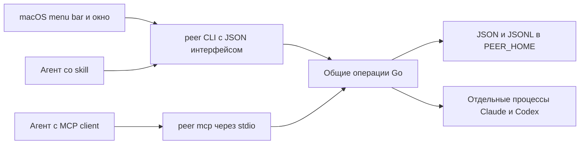

# macOS приложение и MCP для peer

- Добавить нативное macOS-приложение как основной пользовательский интерфейс наблюдения и управления комнатами.
- Сохранить CLI и skill как кроссплатформенную основу. Пока оставить TUI для терминального сценария и Linux.
- MCP сделать дополнительным интерфейсом того же Go-бинарника, например командой `peer mcp` со stdio. Это предполагаемое имя новой команды, сейчас её нет.
- Использовать существующие операции Go и файловое хранилище. Отдельный постоянный daemon, SQLite и перенос ядра в отдельный пакет сейчас не обоснованы.
- MCP Tasks и Claude Channels рассматривать отдельно, проверяя поддержку конкретных клиентов. Не обещать универсальное пробуждение агента от любого MCP-события.

Предлагаемый порядок: сначала приложение и небольшой JSON-интерфейс CLI, затем базовый stdio MCP, далее эксперименты с Tasks или Channels по подтверждённой потребности. Это рекомендация, а не согласованный план выпуска.

## Как peer устроен сейчас

`peer` объединяет локальных coding agents в одной задаче и одном Git checkout. Writer редактирует файлы; остальные участники обсуждают и проверяют изменения. Участники именуются по ролям, например `reader`, `test-expert`. CLI запускает headless Claude Code или Codex; другие агенты могут присоединиться вручную. Отдельные API-ключи моделей самому peer не требуются, но CLI агентов должны быть установлены и авторизованы.

Go-код находится в одном `package main`. Основные точки входа для следующей сессии:

| Файл относительно корня checkout | Что изучить и переиспользовать |
| --- | --- |
| `main.go` | `run`, разбор CLI, `waitTimeout`, `installDir`, встроенные инструкции `peer skills` |
| `store.go` | `session`, `member`, `message`, `openStore`, `locked`, `send`, `post`, `nextMessage`, `wait`, `refresh`, `load`, `end`, `close` |
| `agent.go` | `memberArgs`, `memberPrompt`, `startMember`, `invite`, запуск и логи фоновых участников |
| `tui.go` | `listEntries`, `entry.key`, `readRoom`, `readLines`, `roomStatus`, формы сообщений и приглашений, `addRequest` |
| `memberlog.go` | Разбор timestamped output Claude и Codex через `memberLogLine` |
| `instructions/flow.md`, `instructions/writer.md`, `instructions/member.md` | Существующий процесс совместной работы |
| `skills/peer/SKILL.md` | Короткий skill, который загружает инструкции командой `peer skills flow` |
| `.goreleaser.yaml`, `.github/workflows/release.yml`, `scripts/install.sh` | Текущие сборки, Homebrew cask и Linux installer |
| `main_test.go`, `tui_test.go`, `Makefile` | Существующие проверки и команды сборки |

### Хранилище и жизненный цикл

По умолчанию хранилище находится в `~/.peer/repos/<checkout-slug-and-hash>/sessions/<room>/`. Переменная `PEER_HOME` меняет базовый каталог. Каждая комната содержит метаданные, `messages.jsonl`, отдельные курсоры участников и файлы логов и завершения процессов.

`store.locked` использует `flock` на `.lock` конкретного checkout. `send`, `post` и `nextMessage` удерживают блокировку вокруг всей последовательности чтения, проверки и записи. Записи JSON заменяются атомарно; сообщения дописываются в JSONL с `fsync`. Блокировка не удерживается всё время жизни комнаты.

`startMember` запускает процесс в отдельной POSIX-сессии через `Setsid`, затем вызывает `Process.Release`. Shell-обёртка пишет exit status в отдельный файл. `store.load` обнаруживает такой файл, отмечает `member.Exited` и отправляет writer уведомление. Это уже существующий механизм, а не будущая работа для GUI. Он не является доказательством обработки всех вариантов аварийного уничтожения всей группы процессов.

Закрытие TUI или чата writer не закрывает комнату. Метаданные комнаты существуют без постоянно работающего peer daemon. Работающий агент остаётся отдельным процессом; его нельзя смешивать с необходимостью отдельного daemon самого peer.

### Получение и просмотр сообщений

Текущий `peer wait ROOM --as ROLE` ждёт одно сообщение до 90 секунд и опрашивает хранилище примерно каждые 200 мс. `nextMessage` продвигает сохранённый курсор роли. Участник должен повторять `wait`, если ему нужен следующий ответ.

TUI читает историю отдельно от курсоров участников. В интерфейсе уже есть пользовательские сообщения через `store.post`, завершение через `store.close` и просьба writer добавить участника. Кнопка приглашения в GUI может сохранить текущий процесс: пользователь выбирает агент и описывает роль, writer получает сообщение, выбирает роль и вызывает `invite`. Это не сетевое приглашение, не токен доверия и не авторизация операции от имени пользователя.

Идентификатор комнаты уникален только внутри checkout. `entry.key` уже различает комнаты по каталогу store и ID. Любой глобальный интерфейс должен учитывать проект вместе с room ID.

### Поддержка платформ

Релизы сейчас собираются для macOS и Linux, `amd64` и `arm64`, с Go 1.27. Windows сейчас не поддерживается: используются `syscall.Flock`, POSIX `Setsid` и shell. Фраза «другие OS» не означает, что Windows можно обещать без отдельной работы.

## macOS приложение

### Пользовательский интерфейс

Рекомендуется значок в menu bar с кратким состоянием и открываемым обычным окном. Полную переписку лучше показывать в окне, поскольку маленький popover неудобен для длинных сообщений и логов.

Предлагаемый первый объём:

- Список комнат всех проектов, активные комнаты первыми.
- Переписка выбранной комнаты и логи фоновых участников.
- Отправка сообщения всем или выбранному участнику.
- Завершение комнаты и просьба writer добавить участника, с поведением существующего TUI.
- Уведомления о важных событиях, например завершении комнаты или выходе участника.

Редактор исходного кода, собственный agent runtime и кроссплатформенный GUI не входят в предложенный первый объём.

### Плюсы и стоимость

Приложение убирает необходимость держать терминал ради наблюдения, упрощает переключение между проектами, чтение и копирование текста, даёт постоянно доступную точку входа и системные уведомления.

Стоимость — второй интерфейс, macOS-сборка, подпись и notarization, проверка совместимости GUI и CLI, обработка отсутствующих CLI агентов. Окружение приложения из Finder может отличаться от shell, поэтому нельзя предполагать, что `claude` и `codex` окажутся в его `PATH`.

Рекомендация по технологии: SwiftUI с AppKit для нужных интеграций macOS. Точная минимальная версия macOS и способ обновления UI ещё не выбраны.

## Предлагаемая архитектура



Приложение вызывает встроенный `peer` через Foundation `Process`, передавая аргументы и stdin без shell-интерполяции. Go остаётся единственным местом логики хранения, проверок ролей, запуска участников и разбора их логов. Swift не должен повторять формат хранилища и операции записи.

Понадобится небольшой машинный интерфейс CLI для глобального списка комнат, истории, логов и пользовательских действий. Часть обычных CLI-команд уже выводит JSON, но полного интерфейса для GUI сейчас нет. Имена новых команд, формат снимков, курсоры просмотра и ограничения размера ответов ещё не определены.

MCP-адаптер может находиться в том же `package main` и вызывать общие Go-операции напрямую. Не нужно заставлять MCP вызывать shell-команды CLI, а CLI — ходить в MCP. Не нужно делать GUI MCP-клиентом только потому, что MCP появился для агентов.

Первый вариант не требует HTTP-порта, общего постоянного daemon, SQLite, XPC-сервиса или универсального слоя плагинов. Процесс `peer mcp`, который хост держит для stdio-связи, является MCP-сервером, но не отдельным постоянно работающим системным сервисом.

### Условия корректности

- Глобальные операции адресуют комнату по проекту и ID, а не одному ID.
- GUI просматривает историю без вызова `wait` за агентскую роль и без продвижения её курсора.
- При подключении GUI, TUI и MCP используются существующие блокировки и проверки Go.
- Настройки окна, выбранной комнаты и прокрутки могут храниться в macOS `UserDefaults`; CLI не обязан знать о них.
- Закрытие приложения не завершает комнаты и участников.
- GUI использует свою комплектную версию CLI; пользовательские конфигурации агентов не переписываются молча.
- Для интерфейса разумно ограничить объём отображаемых логов; SQLite и отдельный поисковый индекс вводить только при подтверждённой проблеме.

## Что даёт MCP

MCP стандартизирует доступ к инструментам и контексту. Для peer полезны tools с JSON Schema, структурированные результаты, обнаружение доступных операций, разрешения на конкретные инструменты и resources для истории или состояния комнаты. См. [спецификацию Tools](https://modelcontextprotocol.io/specification/2026-07-28/server/tools).

Агент сможет передавать явные параметры проекта, комнаты, роли и текста вместо сборки shell-команд. Это сокращает ошибки с `--as`, quoting и compound commands. Во время обсуждения Claude действительно сталкивался с запрещённой shell-обёрткой и неверными аргументами peer. MCP уменьшает эту поверхность ошибок, но не отменяет проверку входных данных и не гарантирует запрета остальных инструментов агента.

Предполагаемые инструменты должны соответствовать существующим операциям создания комнаты, присоединения, приглашения, отправки, получения сообщений, просмотра состояния и завершения. Окончательный каталог и схемы ещё не согласованы. В современном stateless MCP нельзя привязывать выбор текущей комнаты только к состоянию соединения.

Skill продолжает объяснять процесс: кто writer, кто редактирует, как обсуждать и проверять работу. Tools сами по себе не заменяют эти инструкции. Основные инструкции уже встроены в бинарник через `peer skills`, поэтому расширение Skills over MCP не является единственным способом держать их рядом с реализацией.

MCP можно предоставить и на Linux той же командой Go-бинарника. Это не добавляет desktop-приложение, но пользователь пока не выбрал, нужен ли ему MCP за пределами macOS.

## Асинхронность и доставка сообщений

### Обычный вызов и фоновая работа хоста

Способность сервера выполнять работу параллельно не равна способности агента продолжать свою беседу во время ожидающего tool call. Планирование агентской работы определяет хост.

Claude Code документирует автоматический перевод MCP-вызова основной беседы в фон после двух минут: Claude получает task ID, продолжает работу и позже получает уведомление о результате. Требуется версия 2.1.212 или новее. В `claude -p` эта возможность включается через `CLAUDE_AUTO_BACKGROUND_TASKS=1`; задача не переживает выход из сессии. См. [Automatic backgrounding of long tool calls](https://code.claude.com/docs/en/mcp#automatic-backgrounding-of-long-tool-calls).

Это функция Claude Code, независимая от расширения MCP Tasks. Она не обещает немедленного фонового выполнения каждого вызова. Для peer важно также помнить, что `invite` уже быстро возвращает управление, пока отдельный участник работает; ожидание его сообщения является другой операцией.

Найденная [документация MCP для Codex](https://learn.chatgpt.com/docs/extend/mcp?surface=cli) подтверждает stdio и Streamable HTTP, но не устанавливает аналогичной гарантии фонового выполнения и пробуждения. На момент исследования `tool_timeout_sec` по умолчанию равен 60 секундам. Текущий CLI `wait` на 90 секунд нельзя механически переносить в MCP: нужны ограниченное ожидание и обработка отмены либо согласованная настройка timeout.

### MCP Tasks

В версии 2026-07-28 Tasks вынесены в официальное расширение `io.modelcontextprotocol/tasks`. Оно позволяет серверу вернуть долговечный `taskId`, затем получать состояние и конечный результат через `tasks/get`, передавать необходимый ввод через `tasks/update` и запрашивать отмену. Базовый способ получения состояния — polling; расширение также описывает `notifications/tasks` через `subscriptions/listen`. См. [MCP Tasks](https://modelcontextprotocol.io/extensions/tasks/overview).

Tasks требуют поддержки клиента и сервера. Само расширение не гарантирует, что конкретный хост автоматически включит результат в контекст агента и продолжит его работу. Долговечность task handle также требует соответствующей реализации хранилища задачи на сервере.

Для первой версии peer MCP Tasks необязательны. При их добавлении отдельно определить жизненный цикл ожидания сообщения, перезапуск MCP-процесса, повторные запросы и момент продвижения курсора. Сейчас `nextMessage` сохраняет курсор до передачи результата вызывающему процессу; существующее поведение не является гарантией exactly-once delivery при разрыве соединения.

### MCP notifications и пробуждение модели

Событие, доставленное MCP-клиенту, и сообщение, которое хост включил в контекст агента, — разные вещи. В 2026-07-28 долгие подписки оформляются через `subscriptions/listen`. Протокол не устанавливает универсального правила «уведомление пришло — модель обязана проснуться». См. [Streamable HTTP](https://modelcontextprotocol.io/specification/2026-07-28/basic/transports/streamable-http).

Обновление resource или списка tools нельзя выдавать за гарантированный произвольный push в агентский диалог.

### Claude Code Channels

Channels — отдельный механизм Claude Code для доставки сообщений из локального MCP-сервера в уже работающую сессию. Сервер объявляет `claude/channel` и отправляет `notifications/claude/channel`; события поступают в контекст Claude. Когда Claude занят, события накапливаются и обрабатываются на следующем ходе. Успешная запись события в транспорт не означает подтверждения обработки. См. [Channels reference](https://code.claude.com/docs/en/channels-reference).

Это потенциально полезно для входящих сообщений другого участника peer, но Channels находятся в research preview, требуют явного включения и имеют ограничения для custom channels. Сессия должна продолжать работать. См. [Channels](https://code.claude.com/docs/en/channels).

**Ключевой конфликт совместимости:** Claude Code не регистрирует channel-сервер, согласовавший MCP 2026-07-28. Для stdio channel пока используется прежний handshake. Это прямо описано в [Push messages with channels](https://code.claude.com/docs/en/mcp#push-messages-with-channels).

Следствие для архитектуры: современный стандартный MCP и Claude Channels нельзя слить в обещание универсального push. Если Channels нужны, предусмотреть отдельно проверяемый режим совместимости. Не распространять его поведение на Codex. Текущий встроенный запуск headless Claude ещё не настроен на этот механизм.

Sampling не решает эту задачу: это запрос генерации через клиента, а не доставка сообщения существующему coding agent; в 2026-07-28 Sampling deprecated для новых реализаций. См. [Sampling](https://modelcontextprotocol.io/specification/2026-07-28/client/sampling).

## Версия протокола транспорты и расширения

### Изменения MCP 2026-07-28

Нельзя строить решение только по знакомой схеме MCP 2025. В исследованной версии удалён прежний `initialize` handshake, запросы содержат версию и capabilities в `_meta`, появился `server/discover`, уведомления изменений оформляются через `subscriptions/listen`, Tasks стали расширением. Подробнее: [Key Changes](https://modelcontextprotocol.io/specification/2026-07-28/changelog).

Совместимость реально используемого Go SDK и клиентов нужно проверить перед выбором поддерживаемых версий. Не следует писать собственную универсальную реализацию нескольких эпох протокола без доказанной необходимости.

### Транспорты

| Транспорт | Рекомендация для peer |
| --- | --- |
| stdio | Первый выбор для локальных агентов. Хост запускает `peer mcp`, порты не нужны. Подписки также возможны через stdio |
| Streamable HTTP | Добавлять при необходимости отдельного сервиса, удалённых клиентов или общего HTTP endpoint |
| Собственный транспорт | Только при конкретной потребности и поддержке обоих концов; не считать Unix socket или WebSocket универсально доступными стандартными MCP-подключениями |

См. [stdio](https://modelcontextprotocol.io/specification/2026-07-28/basic/transports/stdio) и [Streamable HTTP](https://modelcontextprotocol.io/specification/2026-07-28/basic/transports/streamable-http). SSE — способ передачи потока внутри HTTP; старый HTTP+SSE transport deprecated. HTTP не нужен только ради уведомлений. Если он появится, учитывать требования проверки Origin, loopback binding для локального сервера и аутентификации.

### Расширения

| Расширение | Потенциальная польза | Ограничение |
| --- | --- | --- |
| Tasks | Долговечные операции, состояние, ввод и конечный результат | Требует поддержки хоста и реализации жизненного цикла задач |
| Skills over MCP | Обнаружение и доставка workflow-инструкций и supporting files вместе с сервером | Поддержка SDK и хостов ещё развивается; чтение ресурса само по себе не активирует skill |
| MCP Apps | Интерактивная панель комнаты внутри поддерживающего клиента | Интерфейс внутри хоста отличается от постоянно доступного menu bar приложения |
| Authorization extensions | Дополнительные способы авторизации | Для первого локального stdio варианта не выявлена отдельная потребность |

Все расширения требуют явной поддержки обеих сторон. Ссылки: [Extensions Overview](https://modelcontextprotocol.io/extensions/overview), [Skills](https://modelcontextprotocol.io/extensions/skills/overview), [MCP Apps](https://modelcontextprotocol.io/extensions/apps/overview).

Community [Extension Support Matrix](https://modelcontextprotocol.io/extensions/client-matrix) на момент исследования недостаточна для доказательства поддержки всех нужных функций конкретными версиями Claude Code и Codex. Источник протокола не заменяет документацию хоста и проверку на установленном клиенте.

## Homebrew и сохранение CLI

Текущая macOS-установка уже использует `brew install --cask r13v/apps/peer`, но cask пока устанавливает CLI. Linux использует `scripts/install.sh`. Обновление Homebrew-копии выполняется через brew, installer-копии — через `peer update`.

Предлагается один macOS-пакет с `Peer.app` и встроенным Go CLI. Homebrew умеет установить приложение и добавить ссылку на встроенный CLI:

```ruby
app "Peer.app"
binary "#{appdir}/Peer.app/Contents/Resources/peer"
```

Это пример cask artifacts, а не готовая полная конфигурация релиза. См. [Cask Cookbook](https://docs.brew.sh/Cask-Cookbook).

GUI вызывает свою комплектную версию бинарника, терминал получает `peer` в Homebrew bin. Обновление приложения и CLI идёт одним комплектом через brew. Не добавлять собственный updater приложения в первую версию без отдельной причины.

При такой упаковке проверить `main.go:installDir`: сейчас функция распознаёт Homebrew по `Caskroom` или `Cellar` в разрешённом пути. После размещения CLI в `/Applications/Peer.app/...` этого признака может не быть. `peer update` не должен перезаписывать bundled CLI, которым управляет Homebrew. Также нельзя переносить нынешнее снятие quarantine с одиночного бинарника как замену нормальной подписи и notarization приложения.

Технически MCP не требует отдельного CLI-интерфейса. Для этого проекта сохранить CLI рационально: он обслуживает агентов без MCP, Linux, скрипты, диагностику и простой вызов Go-операций из приложения. MCP может быть ещё одним режимом того же бинарника.

Удаление CLI peer не устраняет зависимость от CLI Claude и Codex: текущий `invite` именно их запускает. Переход на собственные API-backed agent runtimes — отдельная архитектура, которая не запрашивалась.

## Разногласия с Claude и их разрешение

| Первоначальное предложение или сомнение | Проверенный результат |
| --- | --- |
| GUI без daemon невозможен, JSONL требует живого процесса | Комнаты сохраняются на диске, блокировки краткоживущие, агенты detached; отдельный daemon не нужен |
| Нужно заменить JSONL на SQLite | Не выявлено ограничения, требующего миграции для первой версии |
| Нужны дополнительные locks для одновременных GUI и TUI | `store.locked` уже оборачивает полные операции проверки и записи |
| Нужно добавить PID files для базового учёта завершения участников | Уже есть exit files и обработка в `store.load`; дополнительные механизмы требуют конкретного воспроизведения недостатка |
| MCP полезен только ради resources и prompts | Typed tools и явные параметры уже дают отдельную пользу, независимо от resources |
| GUI стоит включить редактирование исходников | Это выходит за первоначальную задачу мониторинга и управления комнатами |
| Для фонового MCP обязательно Tasks | Claude Code имеет отдельное автоматическое backgrounding обычных вызовов |

После проверки Claude согласился с общей схемой CLI и GUI без постоянного daemon и с отдельным опциональным MCP-адаптером. Эти выводы подтверждают осуществимость подхода, но не заменяют согласование конкретного интерфейса и проверку новой реализации.

## Что определить в следующей сессии

До разработки согласовать только решения, которые действительно меняют продукт или интерфейс:

1. Первый релиз включает только приложение и JSON CLI или сразу базовый MCP.
2. Заменяет ли приложение TUI полностью на macOS или TUI остаётся доступным выбором. Рекомендация — пока оставить.
3. Насколько нужен немедленный push в агентский контекст. Если это основная цель, отдельно проверить Claude Channels до проектирования остального MCP.
4. Какие реальные хосты поддержать сначала: Claude Code CLI, Codex CLI, desktop-приложения; какие версии протокола и SDK подходят каждому.
5. Минимальная версия macOS, установка CLI без GUI на macOS, запуск приложения при входе и политика уведомлений.
6. Минимальный JSON-контракт для GUI и каталог MCP tools, способ задания проекта и безопасного выбора роли, ожидание и отмена.
7. Является ли Linux единственной другой целевой платформой; Windows считать отдельным объёмом работ.

Не создавать заранее общий daemon, базу данных, plugin framework или несколько GUI. При подтверждении потребности предложить минимальное расширение текущего решения.

## Проверки для будущей реализации

Это критерии будущей работы, а не отчёт об уже выполненных тестах. В обсуждении изучались код и официальные документы; MCP-прототип и GUI не запускались.

Для приложения и JSON CLI проверить:

- Две комнаты с одинаковым ID в разных checkout показываются и адресуются правильно.
- Просмотр и переключение комнаты не продвигают курсоры агентов и не теряют сообщения.
- GUI и TUI одновременно используют одну комнату без потери записей.
- Пользовательские сообщения, завершение и просьба добавить участника сохраняют поведение TUI.
- Закрытие и повторное открытие приложения сохраняют комнаты и работающих участников; обычный выход участника отражается через существующий механизм.
- Приложение из Finder находит CLI агентов либо даёт понятное сообщение об их отсутствии.
- Пробелы и shell-символы в путях и сообщениях передаются данными.
- Уведомления не дублируются при обновлении снимка; отказ в разрешении на уведомления не мешает работе приложения.
- Homebrew устанавливает приложение и совместимый CLI; upgrade обновляет комплект; `peer update` не перезаписывает Homebrew bundle.

Для MCP проверить отдельно:

- Реальные Claude Code и Codex обнаруживают и вызывают базовые инструменты через выбранный SDK и версии протокола.
- Все ответы на stdout являются MCP; диагностический вывод идёт в stderr.
- Операции используют проверки Go, неверные параметры возвращают понятные ошибки.
- Ожидание укладывается в timeout клиента; отменённый запрос не оставляет бесконечную ожидающую работу.
- Фоновый результат действительно становится доступен агенту во время другой работы, если это заявлено для данного хоста.
- Для Channels событие поступает в нужную работающую Claude-сессию на совместимой версии; проверены отключённый channel и ограничения custom channel.
- Для Tasks, если они входят в объём, проверены disconnect, reconnect, перезапуск сервера, получение результата и последствия для курсора сообщения.

Существующие команды проекта:

```sh
make test
make lint
make build
```

`make test` запускает `go test -race ./...`; `make lint` использует `golangci-lint`; `make build` собирает Go CLI. Они не проверяют будущую macOS-сборку. Для неё потребуется macOS runner с выбранным Swift toolchain; подпись релиза требует соответствующей конфигурации Apple Developer. `make all` включает форматирование, поэтому не использовать его как чисто read-only проверку.

## Продолжение в чистой сессии

Можно начать новую сессию таким запросом:

```text
Прочитай docs/2026-10-01-macos-app-and-mcp.md и применимые инструкции проекта.
Это самодостаточный контекст предыдущего обсуждения macOS-приложения и MCP для peer.
Сначала сверь текущий код с запиской. Обсуди мой новый вопрос или выбранный объём
с Claude через skill peer. Отличай требования пользователя от рекомендаций документа.
Не проектируй daemon, SQLite и дополнительные абстракции без конкретной необходимости.
Ниже я укажу, что именно обсуждать или реализовывать.
```

Требования к работе из предыдущего контекста: явно обозначать предположения, читать операции и callers до изменений, переиспользовать текущие решения, делать минимальный diff и проверять пользовательский результат. Пользователь предпочитает простые решения без спекулятивных расширений. При содержательном разногласии опираться на код или официальную документацию и объяснять выбранный вариант.
